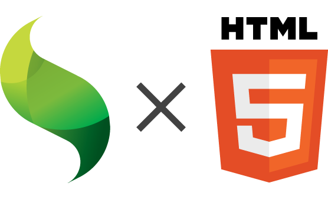
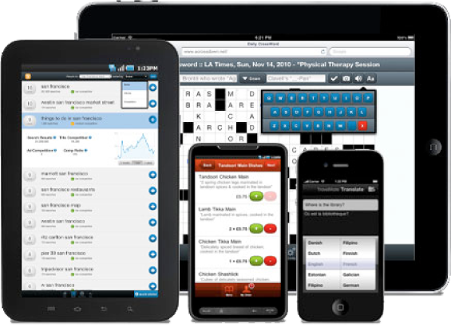
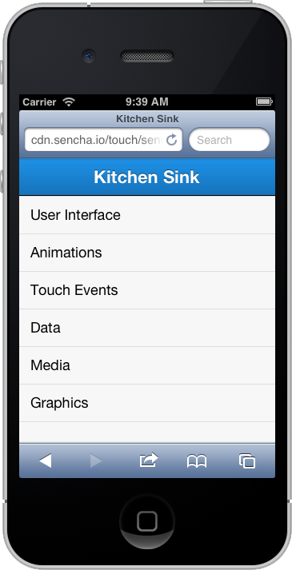
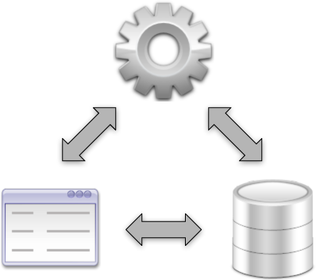

# Introduction Sencha Touch 

---

### 松岡 宏満

* 株式会社W・I・Z
* JavaScript/Java/PHP
* 業務Webアプリ作ったり
* Sencha Touch でモバイルWebアプリ作ったり
* ネイティブアプリ作ったり
* サーバ作ったり
* etc...

---

## Sencha Touch？

[Sencha](http://www.sencha.com/) 社が提供するモバイルWebアプリのJSフレームワークです。

他にExtJSとか提供されてます。

---

## Fastbook

[http://fb.html5isready.com/](http://fb.html5isready.com/)

---

## JDI

[http://jdi.abysscorp.org/](http://jdi.abysscorp.org/)

---

## Weathy

[http://www.loopthy.com/](http://www.loopthy.com/)

---

## Snapsmate

[http://snapsmate.com/](http://snapsmate.com/)

---

## Sencha Touchの特徴

* ワンソースマルチデバイス開発
* 豊富なコンポーネント
* MVC
* ビルドシステム
* テーマシステム
* 豊富で高機能なドキュメントサイト

---

## ワンソースマルチデバイス開発

* iOS 4以上
* Android 2.3以上
* BlackBerry 6以上
* Windows Phone 8

2.2からWebkit依存がなくなり、WP8もサポート！

FireFox for Mobileもサポートするらしい

---

## 豊富なコンポーネント

* リスト
* フォーム
* カルーセル
* ボタン
* タブ
* etc…

とりあえず [Kitchen Sink](http://docs.sencha.com/touch/2.2.0/touch-build/examples/kitchensink/index.html)

必要な部品は大体揃っていて、高機能。

足りない場合は自作かプラグイン形式で拡張可能。

---

## MVC

堅牢なクラスシステムが採用されているのでスパゲッティコードになりにくい。

それなりに学習コストはかかる･･･。
が、習得してしまえば生産性は高い。

---

## ビルドシステム

Sencha 社提供のCLIツール [Sencha Cmd](http://www.sencha.com/products/sencha-cmd/)を利用する。

scaffoldのイメージです。

* プロジェクト作成
* クラス作成
* ビルド
* ネイティブビルド
* Antベースなので、好きなように拡張可能

---

## テーマシステム

* Sass/Compass を利用したテーマシステム
* 変数を変えたり、Mixinで引数を変えてコンパイルすれば、簡単にカスタマイズできる

---

## 豊富で高機能なドキュメントサイト

[Sencha Docs](http://docs.sencha.com/touch/2.2.0)

* APIドキュメント
* サイト内でのJS実行
* ガイド集
* ビデオガイド集
* サンプル

ここを見れば、だいたいのことは解決する。

---

## ライセンス

* Commercial Software License (Free)
* Commercial Software License (Embedded Devices)
* Commercial OEM License (Paid license)
* Open Source License

---

## その他ツール

### Sencha Architect

ExtJS / Sencha TouchのGUI開発ツール。Visual Studioみたいな感じ。

Sencha Complete/Sencha Touch Bundleに含まれる。単体での購入も可能。

開発スタート時のモックやスケルトン開発で利用しています。

### Sencha Eclipse Plugin

ExtJS/Sencha Touch用のEclipseのプラグイン。ExtJS/Sencha Touchのアーキテクチャに沿って、クラス生成、コード補完など。
    
---

## その他サイト

### Sencha Market

テーマやプラグインが販売・公開できるサイト。

### Sencha Try

ユーザ同士のノウハウをサンプルソースで共有するサイト。Sencha Docsで解決しない場合はここを参考にしてます。
    
### Sencha Forum

Sencha の掲示板サイト。バグ報告やTipsなど様々な情報がある。

---

##

# ご静聴ありがとうございました。

