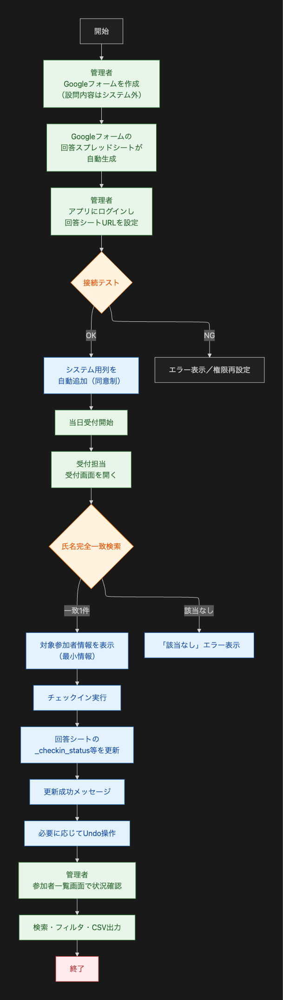

<!-- _class: lead -->

# AIと話して作る、はじめてのアプリ開発

## 🚀 First Ride Engineering chap.3

**2025年 @ mark MEIZAN**

---
# 📍 本日のアジェンダ

1. **AIエージェントの基礎** - 20分
2. **Cursorセットアップ** - 10分
3. **初めてのVibe Coding** - 20分
4. **休憩** - 10分
5. **Chrome拡張機能開発** - 30分
6. **Q&A・懇親** - 20分

---

# 👤 自己紹介

名前: **松岡 宏満**
所属: [株式会社W・I・Z](https://www.wiz-net.jp) 代表取締役 / mark MEIZAN運営
専門分野: IT技術全般
Twitter: [@ispern](https://x.com/ispern/)

> 奄美大島在住。
好きな技術はフロントエンド全般。
趣味は大工仕事とカメラ。
会社の経営とエンジニア、家業の畜産農家を徳之島でやってます。
---

<!-- _class: lead -->

# 🤔 プログラミングできない = アプリが作れない？

## **その常識、今日で変わります**

---

# Vibe Codingとは？
### 従来のプログラミング学習

英語の命令を覚える → それを正確に書く → エラーと戦う

### Vibe Coding

日本語で「こんな感じ」を伝える → AIが翻訳 → 一緒に改善する

## 日本語で伝えながら

```
あなた: ToDoアプリを作って

AI: 了解しました！タスクの追加・完了・削除機能を
    含めたアプリを作成します...
```

---
# 最初に伝える大切なこと

## AIは「魔法の杖」ではなく「パワーツール」

> AIと対話するだけでアプリは作れます。
> でも、より良いものを作るには、少しずつ知識も必要です

### 料理に例えると
- 🍱 冷凍食品をレンジで → 誰でもできる
- 🍳 レシピ通りに作る → 基本を知れば作れる
- 🍝 レシピをアレンジ → 原理が分かってくる
- 👨‍🍳 オリジナル料理 → プロに近づく

---

#  🛠️ 今回使うツールの紹介

## 2つの重要なツール

### 1. **エディタ（Cursor）**
プログラムを書くための専用ソフト
- コードを書く・編集する場所
- AIと対話しながら開発

### 2. **ターミナル（コマンドプロンプト）**
黒い画面でコマンドを実行
- ファイルの操作
- プログラムの実行
---

# 📝 そもそもエディタって何？

## プログラムを書くための専用ソフト

### 身近な例で理解する

| ソフト       | 用途           | 機能             |
| ------------ | -------------- | ---------------- |
| **メモ帳**   | 簡単なテキスト | 文字を書くだけ   |
| **Word**     | 文書作成       | 装飾・レイアウト |
| **エディタ** | プログラミング | コード専用機能   |

### エディタの特別な機能
- 🎨 **色分け表示** - コードが見やすい
- 💡 **自動補完** - コード予測
- ❌ **エラー表示** - 間違いを教える

---

# 💻 CLIツールって何？

## コマンドラインインターフェース

### 黒い画面で操作するツール

| OS          | 名称               | 開き方                      |
| ----------- | ------------------ | --------------------------- |
| **Windows** | コマンドプロンプト | Windowsキー → 「cmd」と入力 |
| **Mac**     | ターミナル         | Launchpad → ターミナル      |

### 使用例
```
> dir              （ファイル一覧を表示）
> cd Documents     （フォルダ移動）
> claude-code      （AI開発ツールを起動）
```

### 📌 今日は使わないけど知っておくと便利！

---

# 🤖 AIツールの分類を理解しよう

## 2つのカテゴリー

1. **汎用AIアシスタント**
   - ブラウザで対話、コードはコピペ

1. **コーディングツール**
   - エディタと完全統合
   - ターミナルで動かすCLIツール

---

# 汎用AIアシスタント

## 対話を通じてコード生成

| ツール名    | 特徴                                       | 料金                    |
| ----------- | ------------------------------------------ | ----------------------- |
| **ChatGPT** | OpenAI社。幅広い知識を持つ汎用アシスタント | 無料/Plus $20/月        |
| **Claude**  | Anthropic社。長文理解と日本語対話が得意    | 無料/Pro $20/月         |
| **Gemini**  | Google社。検索との連携が強み               | 無料/Advanced $2,900/月 |

<br>

### ⚠️ 課題
生成されたコードを**手動でコピペ**する必要がある

---

# AIコーディングツール

## ターミナルで動かすAI開発ツール（CLIツール）

| ツール名        | 特徴                  |
| --------------- | --------------------- |
| **Claude Code** | Anthropic公式CLI      |
| **CodeX**       | OpenAI公式CLI         |
| **Cline**       | VS Code拡張として動作 |

### 💡 特徴
プロジェクト全体を理解し、**複数ファイルを自動編集**

---


## エディタに統合されたAI

| ツール名           | 特徴                                      | 料金            |
| ------------------ | ----------------------------------------- | --------------- |
| **Cursor**         | VS Codeベースの統合開発環境。AIが完全統合 | 無料/Pro $20/月 |
| **GitHub Copilot** | VS Code等の拡張機能。コード補完特化       | $10/月（個人）  |
| **Windsurf**       | コード編集に特化したAIエディタ            | 無料/Pro $15/月 |

### ✨ メリット
エディタ内で**シームレスに開発**できる

---

# 通常のエディタ vs Cursor

### 従来の開発フロー（VS Codeなど）

```
1. 自分でコードを書く
2. エラーが出たら自分で調べる
3. AIに聞くならブラウザへ移動
4. 回答をコピペして戻る
```

### Cursorの開発フロー

```
1. 日本語で「〇〇を作って」と依頼
2. AIが自動でコード生成、エラーも自動で修正
4. すべてエディタ内で完結
```

### ✨ **コードが書けなくても大丈夫！**

---

# 📌 今日使うのは **Cursor**

1. **統合型**
   - ソースコードはコピペ不要、直接編集可能

2. **日本語対応**
   - AIとの対話が自然

3. **無料プランあり**
   - 今日のワークショップはこれでOK

4. **VS Codeベース**
   - 世界標準のエディタがベース

---

# 他の選択肢：エディタ × AIの組み合わせ

## いろいろな組み合わせが可能

### 🔧 **VS Code × GitHub Copilot**
世界で最も使われている組み合わせ

### 💻 **各種エディタ、IDE × Claude Code**
IntelliJ IDEA、Cursor、Visual StudioとClaude Code

---

### 🌐 **ブラウザ × ChatGPT/Claude**
エディタなし、ブラウザのみで完結

### 📱 **Cursor、Windsurf、Zed等の新世代エディタ**
AI機能が最初から組み込まれている

### 🎯 **今日はCursor**
初心者に最も簡単で、すぐに始められる

---

# ⚙️ Cursorのセットアップ

## STEP 1: ダウンロード
```
https://cursor.com/ja/downloads
```

## STEP 2: 初期設定
- アカウント作成（メールアドレスのみ）
- 日本語設定: `Settings → Language → Japanese`

## STEP 3: 今日は無料プランでOK！

---

# 🎯 最初のプロジェクト

## カウンターアプリを作ろう！

### 手順
1. 新規ファイル作成: `Ctrl+N` (Mac: `Cmd+N`)
2. ファイル名: `counter.html`
3. AIチャット: `Ctrl+K` (Mac: `Cmd+K`)

### AIへの指示
```
シンプルなカウンターアプリを作って
・プラスボタンで1増える
・マイナスボタンで1減る
・リセットボタンで0に戻る
```

---

<!-- _class: lead -->

# 🔧 Chrome拡張機能を作成する

## 実践的な2つのプロジェクト

---

# プロジェクト1: タイトルコピーツール

## 📋 基本的な拡張機能

```
Chrome拡張機能を作ってください。
・現在のページのタイトルとURLをコピー
・コピー完了の通知表示
・必要なファイルを全て作成
```

### 必要なファイル
- `manifest.json` - 設定ファイル
- `popup.html` - UI
- `popup.js` - ロジック

---

# 🔐 プロジェクト2: パスワード生成ツール

## より実践的な開発アプローチ

### なぜ必要？
- 人間が考えるパスワードは **予測されやすい**
- サイトごとに **異なるパスワード** が必要
- 複雑なパスワードは **覚えられない**

---

# 実践的な開発手法

## 📝 要件定義ファイルを作成

### `requirements.md`
```markdown
# パスワード生成ツール 要件定義

## 必須機能
- [ ] 8〜32文字の長さ選択
- [ ] パスワード生成ボタン
- [ ] クリップボードへのコピー

## 文字種設定
- [ ] 大文字・小文字・数字・記号のON/OFF
```

---

# AIへの指示方法（実践版）

### ドキュメント駆動開発

```
requirements.mdを読み込んで、タスク一覧をtask.mdとして作成して
```

task.mdが出来上がったら...

```
@task.mdを確認して、タスクXXXの実装をお願い
```
---

# 💡 なぜこの方法が実践的？

1. **明確な仕様**
   - 作りたいものが文書化されている

2. **段階的な実装**
   - タスクを一つ一つ実装することで、動作確認しながら進める

3. **再利用可能**
   - 要件定義は保存・修正が簡単
   - 同様にタスクも修正して進めることができる

---

# 🚦 AIが生成したコードを「判断」する力

## 判断力のレベルアップ

### 🟢 1. 動くかどうか
- 画面に表示される？
- ボタンを押したら反応する？

### 🟡 2. 使いやすいか
- 文字は読みやすい？
- 操作は分かりやすい？

### 🔴 3. 正しく動作するか
- 計算結果は正確？
- データは正しく保存される？

---

# 📚 知っておくと格段に良くなること

## 優先度別の学習項目

### 🔴 これだけは知りたい（基礎の基礎）
- **HTML/CSS** → 何がどこに表示されるか理解
- **JavaScript基礎** → ボタンを押したら何が起きるか理解
- **デバッグ方法** → 動かない時に原因を特定

### 🟡 知ってると便利（一歩先へ）
- **Git** → 失敗しても前の状態に戻せる
- **API** → 天気情報など外部データを使える
---

# 🌟 実践

## イベント参加者管理アプリ

このファイルをダウンロードして、使います。

[要件定義書](./requirements.md)
[タスク一覧](./tasks.md)

---

## ユーザーフロー図



---

# ⚠️ つまづいたときは

## 困ったときの対処法

- **エラーメッセージをそのままAIに**
  - F12で開発者ツールを開いてコピー

- **分からないことをそのままAIに**
  - 使っているAIとは異なるAIに聞くのも効果的

- **もっとシンプルな方法を依頼**

---

# 学んだこと

## ✅ 新しいスキルを習得

- **AIは「パワーツール」である** - 魔法の杖ではない
- **Cursorの使い方** - 日本語で指示できる開発環境
- **Chrome拡張機能の作り方** - 実用的なツール開発
- **実践的な開発プロセス** - 要件定義からスタート

---

# 学んだこと

## 🚀 3つの大切なこと

1. **小さな一歩の積み重ねが大切**
2. **エラーは学習機会**
3. **分からないことは何でもAIに聞いて理解を深める**

---

# 🚀 さらなる成長のために

### 📚 学習を続ける
- 作ったアプリを改良
- 新しいアイデアに挑戦

### 🤝 仲間を見つける
- mark MEIZANや鹿児島で開催されているエンジニア向けのイベントに参加

### 🎯 スキルアップ
- GitHubでコード管理
- 実際のWebサービスとして公開

---

# 📚 参考リンク

## 今後の学習に役立つリソース

- [Zenn｜エンジニアのための情報共有コミュニティ](https://zenn.dev/)
- [x.com](https://x.com/) のAI関連の発信をしているアカウントのフォロー
- [MDN Web Docs](https://developer.mozilla.org/ja/)

---

<!-- _class: lead -->

# 🎊 Happy Coding with AI!

## ご参加ありがとうございました
